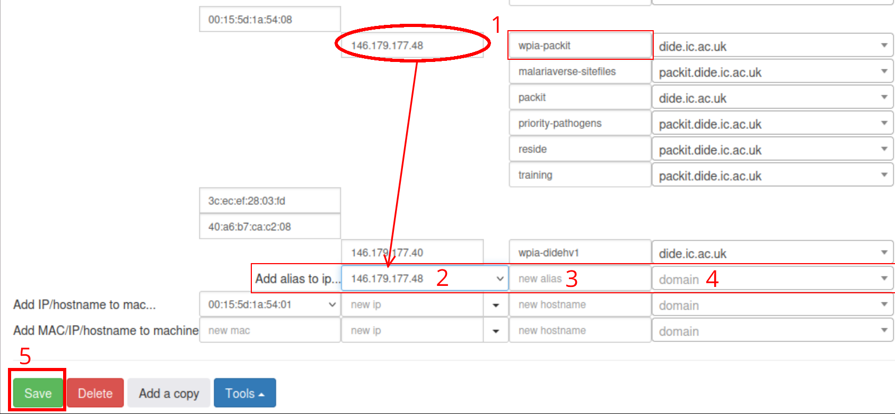

# Adding a new Packit instance

These instructions will deploy a new Packit instance to an existing machine.
The instructions assume you already have a machine setup and an associated
GitHub application. Assuming the machine already has one instance deployed, its
GitHub application can be reused for the new instance. See
[the new machine playbook](new-machine-provisioning.md) for details on creating
a GitHub application.

The instructions use the following placeholders:
- `<hostname>` is the name of the machine that will be hosting the instance (eg. `wpia-packit`).
- `<shortname>` is that same name, but without the `wpia-` prefix (eg. `packit`).
- `<instance>` is the name you have chosen for the new instance. The instance
    name should only use alphanumerical characters and `-`. It should be unique
    within its machine, and preferably globally unique among all machines to avoid
    confusion.

## Configuration and deployment

Edit the relevant `machines/<hostname>.nix` file and add a new entry to the
`services.packit.instances` list.

You will need to customize the instance by configuring some of the
`services.packit-api.<instance>` options. At the minimum, you will want to
set `authentication.method` to `"github"` and set `authentication.github.org`.
All members of this organisation will be allowed to access the instance using
their GitHub account.

Additionally, you may set a `authentication.github.team` value to restrict
access to just one team within that organisation.

Deploy the modified configuration to the server as usual.

## Updating DNS records

> [!IMPORTANT]
> Access to HDB is restricted and you may not have permission to complete this
> section yourself. At the time of writing, only Wes and Paul have access.

The new Packit instance will be hosted at `<instance>.<shortname>.dide.ic.ac.uk`.
New DNS entries need to be added to map that domain name to the right IP address.

The DNS configuration is done through HDB, which is ICT's tool to manage hosts
across the college. Visit https://hdb.ic.ac.uk/Zope/HDB and find the machine
using the search tool, looking up `<hostname>`. This should open up the page
for the hypervisor hosting the server.[^vm]

[^vm]: The Packit machines are actually virtual machines, running on a Windows
    hypervisor. The same hypervisor will host many other RESIDE services,
    unrelated to Packit.

1. Find the entry for `<hostname>` and note down the associated IP address. You
   can also confirm that IP address using the `host` command:

    ```
    $ host wpia-packit.dide.ic.ac.uk
    wpia-packit.dide.ic.ac.uk has address 146.179.177.48
    ```

2. At the bottom of the HDB configuration page, find the "Add alias to ip..."
   row and select the correct IP in the dropbox.
3. Use `<instance>` as the "new alias"
4. Use `<shortname>.dide.ic.ac.uk` as the domain.
5. Click "Save".



It might take a little while for the records to be updated. According to ICT,
there is a 3 minutes lag between HDB and their DNS servers. The DNS resolver
and intermediate nameservers may also have a cached negative result, which can
take a while to clear &mdash; empirically it seems to be up to 15 minutes.

You can use the `dig` command to check the progress of the propagation. By
default `dig` uses your local resolver and intermediate nameservers, like any
other application. `dig +trace` will perform the resolution itself, bypassing
any cached negative result.

## Authorizing the Github application

The OAuth application on Github manually needs to be granted permission, by one
of the organisation's admins, to access the organisation. See
[the GitHub documentation][github-oauth-org]. Because we use a single OAuth app
for all instances hosted on the same machine, this only needs to be done once
per org and machine, even if it is used by multiple instances.

[github-oauth-org]: https://docs.github.com/en/account-and-profile/setting-up-and-managing-your-personal-account-on-github/managing-your-membership-in-organizations/requesting-organization-approval-for-oauth-apps

## Creating an initial admin

When the server is first deployed, no user has administrator priviledges. You
must manually grant add you GitHub account to the ADMIN role:

1. Log in to the instance with your GitHub account.
1. SSH onto the server.
1. Run `grant-role <instance> <username> ADMIN` where `<username>` is your
   GitHub username.
1. Log out and back in for the changes to take effect.

Afterwards permissions may be managed through the web UI.
